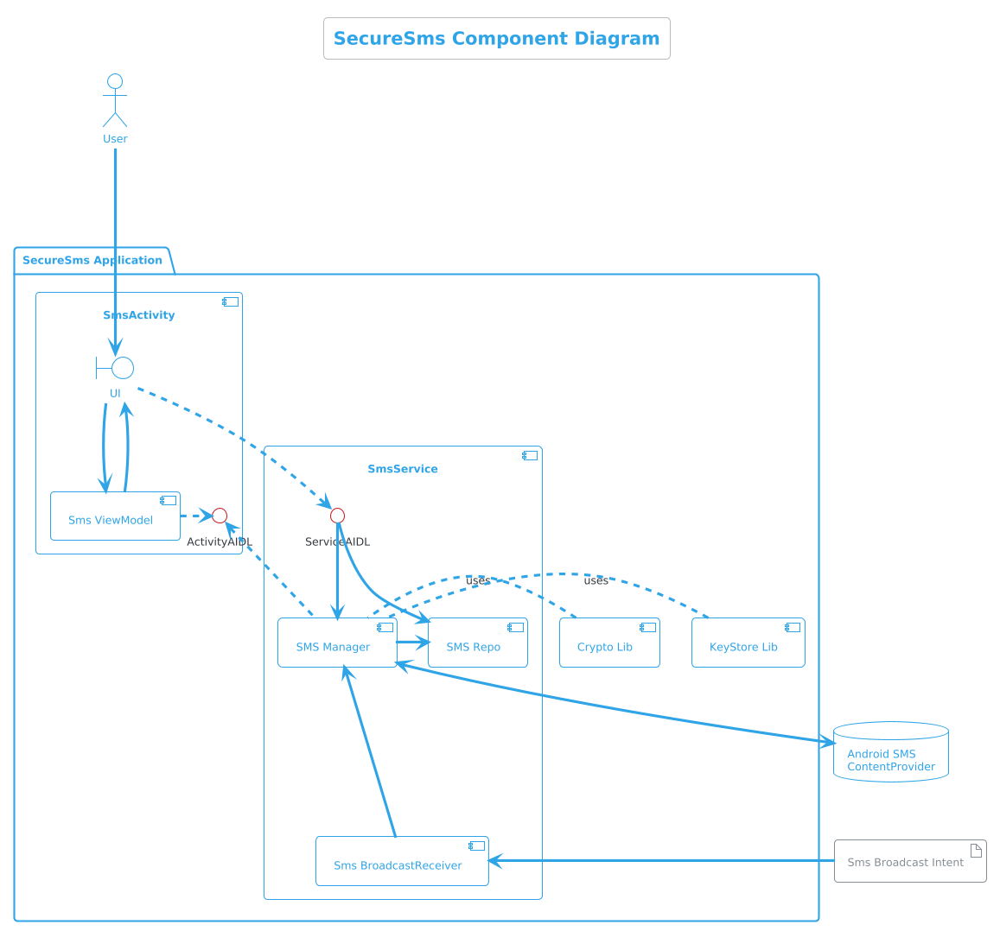

# SecureSms - SMS Management Android Application

This Android application provides comprehensive *Secure* SMS management functionality.
We are aiming to develop an open source Android Sms application helping to secure the communication through encryption and also sharing and storing the encryption keys.


## Phase 1
We will complete the basic functionalities of a SMS manager application

## Phase 2
Generating, sharing and storing encryption and signing keys and also sms encryption


## Features

- **BroadcastReceiver**: Automatically receives incoming SMS messages
- **SMS Manager**: Fetches all SMS messages from the device
- **Categorization**: Groups SMS messages by phone number
- **Contact Integration**: Shows contact names when available
- **Permission Handling**: Proper runtime permission management
- **Modern UI**: Built with Jetpack Compose

## Architecture

### Core Components

We are going to implement the below structure which shows the big picture of the application component level



```plantuml
!include ./component-level.puml

1. **SmsReceiver** - BroadcastReceiver for incoming SMS
2. **SmsManager** - Main class for SMS operations
3. **SmsRepository** - Data layer for managing SMS data
4. **Data Models** - SmsMessage, SmsConversation, SmsType
